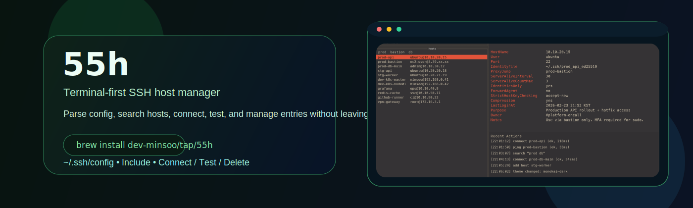
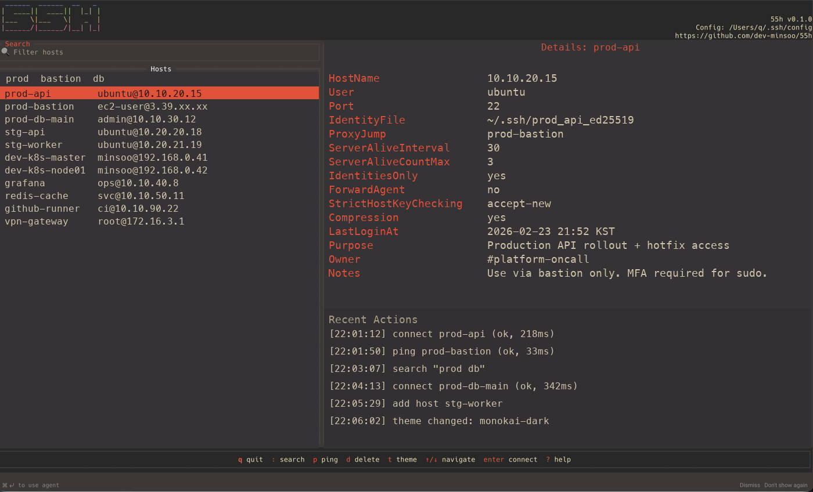

<p align="center">
  
</p>

<h1 align="center">55h</h1>

<p align="center">
  Go + <code>tview/tcell</code> 기반의 터미널 중심 SSH 호스트 매니저
</p>

<p align="center">
  <a href="#설치"></a>
  <a href="LICENSE"></a>
  <a href="#설치"></a>
  <a href="#설치"></a>
</p>

<p align="center">
  <code>brew install dev-minsoo/tap/55h</code>
</p>

`55h`는 SSH 호스트 관리의 반복 작업을 빠르게 처리하는 데 집중했습니다.

## 한눈에 보기

- `~/.ssh/config`와 `Include` 대상 파일을 재귀적으로 파싱
- 탐색, 검색, 실행 작업을 하나의 TUI 플로우로 통합
- 연결/테스트/삭제/추가를 키보드 중심으로 빠르게 수행

## 스크린샷



## 왜 55h인가

- `55h`가 시각적으로 `ssh`를 연상시키는 네이밍
- Host 목록과 상세를 한 화면에서 확인 가능
- 처음부터 끝까지 터미널/키보드 중심 워크플로우

## 핵심 기능

- SSH `Host` 목록 + 상세 패널
- 별칭/호스트/유저/옵션 대상 검색
- 앱 내 핵심 액션:
  - 연결
  - 핑/연결 테스트
  - 소스 파일의 Host 블록 삭제
- 테마 선택 및 사용자 설정 저장
- CLI 추가 기능: `55h add ssh ...`

## 설치

### Homebrew (macOS)

```bash
brew install dev-minsoo/tap/55h
```

### 소스에서 빌드

Go `1.21+` 필요:

```bash
go build -o 55h .
./55h
```

### SSH 설정 경로 재정의

```bash
SSH_CONFIG=/path/to/config ./55h
```

## 사용법

```bash
55h
```

기본 경로는 `~/.ssh/config`이며, `Include` 지시자를 따라 추가 파일도 함께 읽습니다.

## 키 바인딩

| 키 | 동작 |
|-----|--------|
| ↑ / ↓ | 호스트 목록 이동 |
| `:` | 검색 포커스 |
| `Esc` | 검색 종료 / 모달 닫기 |
| `Enter` | 선택 호스트에 연결 |
| `p` | 연결 테스트 |
| `d` | 선택 호스트 블록 삭제 |
| `t` | 테마 선택 |
| `q` | 종료 |
| `?` | 도움말 |

연결 테스트 실행 명령:

```bash
ssh -o ConnectTimeout=5 -o BatchMode=yes -o StrictHostKeyChecking=accept-new <alias> exit 0
```

## CLI: `add ssh`

```text
55h add ssh user@host [-p port] [-i identity] [-J jump] [-o Key=Value ...] [--name alias]
```

### 지원 플래그

- `-p <port>`: `Port`
- `-i <identity>`: `IdentityFile`
- `-J <jump>`: `ProxyJump`
- `-o Key=Value`: 추가 SSH 옵션
  - `forwardagent` (`yes|no`)
  - `identitiesonly` (`yes|no`)
  - `serveraliveinterval` (정수)
  - `serveralivecountmax` (정수)
- `--name <alias>`: 호스트 별칭 강제 지정

## 기여

이슈와 PR을 환영합니다.

### PR 열기 전 체크

1. 저장소를 포크하고 기능 브랜치를 만듭니다.
2. 로컬 점검을 실행합니다.

```bash
make fmt
make vet
make test
make build
```

3. 앱 동작을 수동으로 확인합니다.

```bash
go run .
```

4. 동작이나 키 바인딩이 바뀌었다면 `docs/`의 문서/스크린샷을 함께 갱신합니다.

### 이슈 작성 가이드

아래 정보를 포함해 주세요.

- OS와 Go 버전
- 관련 SSH 설정 샘플(민감정보 제거)
- 기대 동작과 실제 동작
- 재현 단계

### 커밋 스타일

권장 접두사:

- `feat:`
- `fix:`
- `docs:`
- `refactor:`
- `test:`
- `chore:`

## 라이선스

MIT
